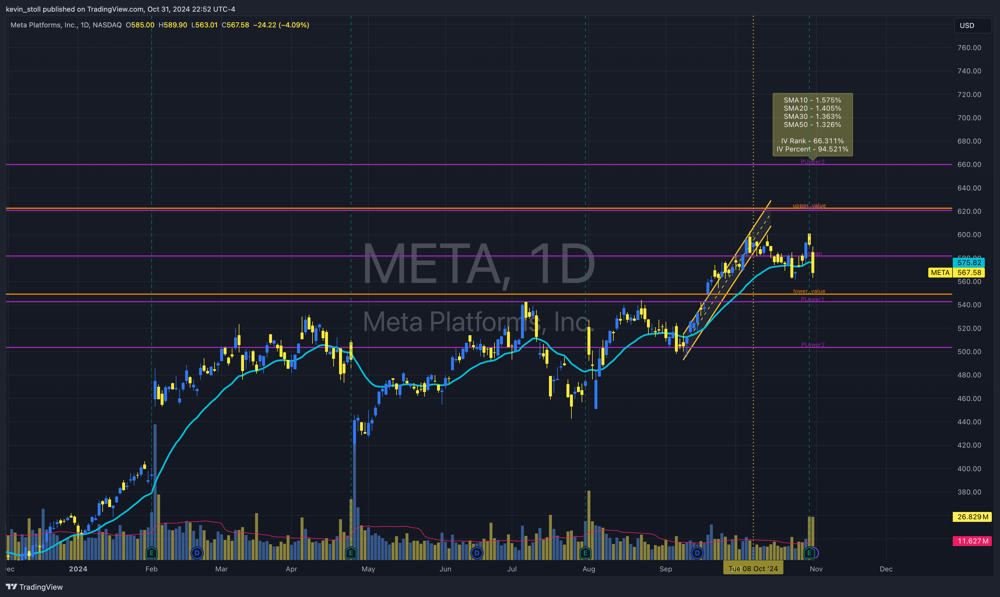

# daily-levels-panting

- Updates daily range levels and save the pine script in daily_range_pine.txt
- We need to create a pine script for TradingView to "paint" the levels each day, to automated creating 8 levels by 8 symbols.
- In tradingview, you add the script to the Pine Editor, Save and Add to Chart, as an indicator. 

## How to use Daily Levels
- COMPLETE ME 


## What each level means
- that's a long story ...
- There are 5 prediction levels and 2 straddle levels
- There are a set of Straddle Percent SMAs (10-50)
- You can see how these are presented in the screenshot below.
- this code snippet is from quantconnect/main.py (line #450) https://github.com/deerfieldgreen/daily-levels-painting/blob/6f461fc562e6f59372bac5bcdbb605bed82ae2a2/quantconnect/main.py#L450

```

                    prediction_dict = {}
                    prediction_dict["ticker"] = ticker
                    prediction_dict["datetime"] = str(self.Time)
                    prediction_dict["spot_price"] = pred_df['price'].iloc[0]
                    prediction_dict["straddle_value"] = pred_df['straddle_front_premium'].iloc[0]
                    prediction_dict["straddle_pct_value"] = pred_df['straddle_front_premium_pct'].iloc[0]
                    prediction_dict["past_straddle_value"] = model_df['straddle_front_premium'].mean()
                    prediction_dict["past_straddle_pct_value"] = model_df['straddle_front_premium_pct'].mean()
                    prediction_dict["past_straddle_value_std"] = model_df['straddle_front_premium'].std()
                    prediction_dict["past_straddle_pct_value_std"] = model_df['straddle_front_premium_pct'].std()
                    prediction_dict["upper_value"] = prediction_dict["spot_price"] + prediction_dict["straddle_value"]
                    prediction_dict["lower_value"] = prediction_dict["spot_price"] - prediction_dict["straddle_value"]
                    prediction_dict["straddle_pct_sma10"] = data_df['straddle_front_premium_pct'].tail(10).mean()
                    prediction_dict["straddle_pct_sma20"] = data_df['straddle_front_premium_pct'].tail(20).mean()
                    prediction_dict["straddle_pct_sma30"] = data_df['straddle_front_premium_pct'].tail(30).mean()
                    prediction_dict["straddle_pct_sma50"] = data_df['straddle_front_premium_pct'].tail(50).mean()

                    implied_vol_cur = yearly_data_df.tail(1)['implied_vol'].iloc[0]
                    implied_vol_min = yearly_data_df['implied_vol'].min()
                    implied_vol_max = yearly_data_df['implied_vol'].max()
                    prediction_dict["implied_vol_rank"] = (implied_vol_cur - implied_vol_min) / (implied_vol_max - implied_vol_min)
                    prediction_dict["implied_vol_percentile"] = (yearly_data_df['implied_vol'] < implied_vol_cur).mean()


```
## What's the Universe?
- you can find this in code: quantconnect/config.py
```
## General Settings
general_setting = {
   "tickers": {
        "QQQ": {"type": "equity"},
        "SPY": {"type": "equity"},
        "SPX": {"type": "equity"},
        "NVDA": {"type": "equity"},
        "TSLA": {"type": "equity"},
        "BABA": {"type": "equity"},
        "META": {"type": "equity"},
        "AMZN": {"type": "equity"},
        "TLT": {"type": "equity"},
        "GLD": {"type": "equity"},
        "SLV": {"type": "equity"},
        "EWZ": {"type": "equity"},
        "IWM": {"type": "equity"}
    },
```

## Stock Splits
- we needed to account for stock splits in the universe set. the price changes based on the ratio of split 2:1 or 4:1, whatever. 
- The quantconnect code pulls from another github repository () for this list, back 5 years (60 months * 30.5 days to be exact)

``` 
data = self.download("https://raw.githubusercontent.com/deerfieldgreen/yfinance-scaling-system/refs/heads/main/data/stock_splits_data.csv")
```

## Flow
1) Receives webhook from QC
2) Processes the data
3) Sends the updated data to txt file stored in this github repo -> daily_range_pine.txt


## Code layout

- Docker container code 
- WebHook running in GCP CloudRun


## TradingView Screenshot

